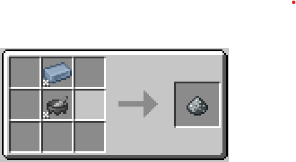
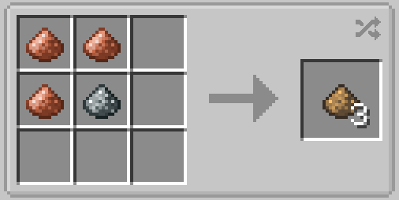

# Bronze

Bronze is the most important material in the [Steam Age](./index.md). 

To prepare the first batch of it you will need [Tin and Copper](../Ore-Generation.md) just crush the ingots with a GT mortar. And then mix them in a crafting table in _3_ to _1_ proportion. Then smelting to receive the ingot.

