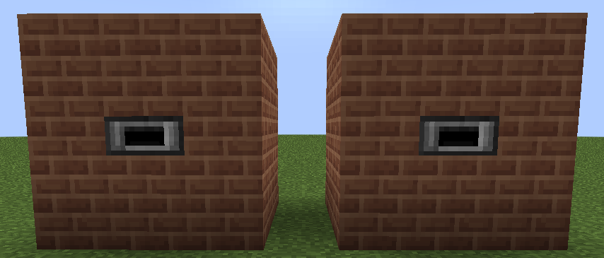
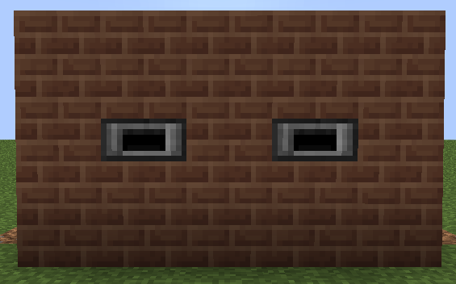

# Generating Steam

## Early game

For early game steam generation you have Three options:

 * Liquid - allowing you to use hot liquids like lava. To heat up water and get steam.
 * Solid - uses coal to heat up the water.
 * Solar - generate steam from solar boilers _doesn't work at night_.

For water you can use a **primitive pump**, it generates water _anywhere_ in the world!

or use a water connection from any other mod, be carefull to set the flow _or the little arrow pointing in the direction you want_, or else all your water pipes will fill with steam!

## Steel
Before you get started on the quest for steel, you'll need a few coke ovens _you should have made these before steam_. you need 116 coke oven bricks to form 1 coke oven. You'll need this for _charcoal_, or _coal coke_. Coal coke is the most effeciant way of making steel in a primitive blast furnace

This is a perfect time to learn about _wall sharing_, probably the **most** usefull feature for multiblocks, it is a feature which allows you to share the walls of a multiblock of the same type, so instead of making 58 coke bricks, you only need _49_ bricks with wall sharing.

    

Now that you have steam machines, you will need a compresser to craft fireclay dust, from brick dust and clay dust, put it into the compresser and wait 3-5 buisness days. Once you have compressed fireclay bricks just smelt them and ta-da, you'll need a lot more. You will need these bricks to craft the Primitave Blast Furnace

![Primitive Blast furnace]

## After Steel

After unlocking steel (using a primitive blast furnace) you will get access to the high pressure versions of the boilers and allow you to produce more steam.

## Large Boilers 

Large boilers allow you to create massive amount of steam in the blink of an eye. A boiler can be constructed of many different GT materials, that will allow for different steam generation rates (_consult the table below_).

## Base Generation Rates 

### Single Block

| Boiler type | Low pressure | High pressure |
| ----------- | ------------ | ------------- |
| Solar       | 6 L/T        | 18 L/T        |
| Liquid      | 12 L/T       | 30 L/T        |
| Solid       | 6 L/T        | 15 L/T        |

### Multiblock 

| Boiler        | Generation | Boil up | Max temp |
| ------------- | ---------- | ------- | -------- |
| Bronze        | 800 L/T    | 40s     | 1074K    |
| Steel         | 1800 L/T   | 90s     | 2074K    |
| Titanium      | 3200 L/T   | 160s    | 3474K    |
| Tungstensteel | 6400 L/T   | 160s    | 6674K    |

*L/T -> Liters per tick (1L = 1mB)