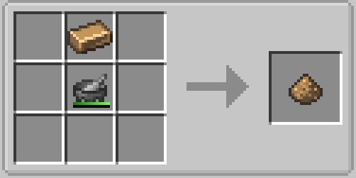

# Welcome to The steam age

Steam is the first of many stages that come with the Gregtech mod. It will be your first encounter with GT machines and tools. Be careful _things may get explosive_. You should craft multiple sets of tools, as you will be using them a lot during this age. The best material available at this age is Wrought Iron until Steel, you will also be needing this for high pressure steam machines, and LV machines, you can craft it by smelting iron nuggets. 

In this age you'll need bronze, lots and lots of bronze, but you'll get a easier recipe in the alloy smelter.
To prepare the first batch of it you will need [Tin and Copper](/docs/Gameplay/Ore-Generation.md) just crush the ingots with a GT mortar. 

{ style="hight=150;width=150"}

Then mix them in a crafting table in 3:1 ratio. Then smelt the dust into an ingot.
{ style="hight=150;width=150"}

To power steam machines you will need to [Generate Steam](/docs/Gameplay/Steam/Steam-Generation.md), learn how to transport steam using pipes. You'll also need a wrench to set the _exhaust_, just sneak and right click on the center of the face you want to set the exhaust to!

## In this tier

Most important material: [**Bronze**](./Bronze.md)

End Goal: **LV machine hull**

Gated by: **Primitive blast furnace**
