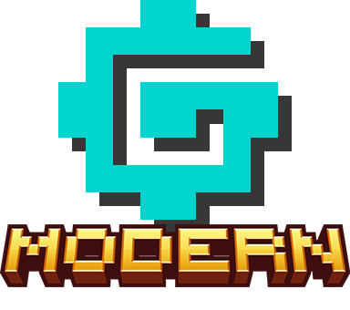

# Gameplay Docs

<figure markdown="span">
    { style="hight=225;width=225"}
    <figcaption> Redstone on, Machine on! -Threefold </figcaption>
</figure>

Welcome to GTCEu Modern, a port of GTCEu 1.12.2 for more modern versions. GregTEch completly overhauls the default minecraft experience, use machines and Materials to progess through the ages.
If this is your first time playing Gregtech, we highly suggest the [GTCEu Community Pack](https://www.curseforge.com/minecraft/modpacks/gregtech-community-pack)

---

GregTech ores generate in large vains placed along a grid. Mine, process, and craft them into various items to progress through different ages of technology. 

---
## Ages

### [Steam](./Steam/index.md)

### [LV]

---

## Tips