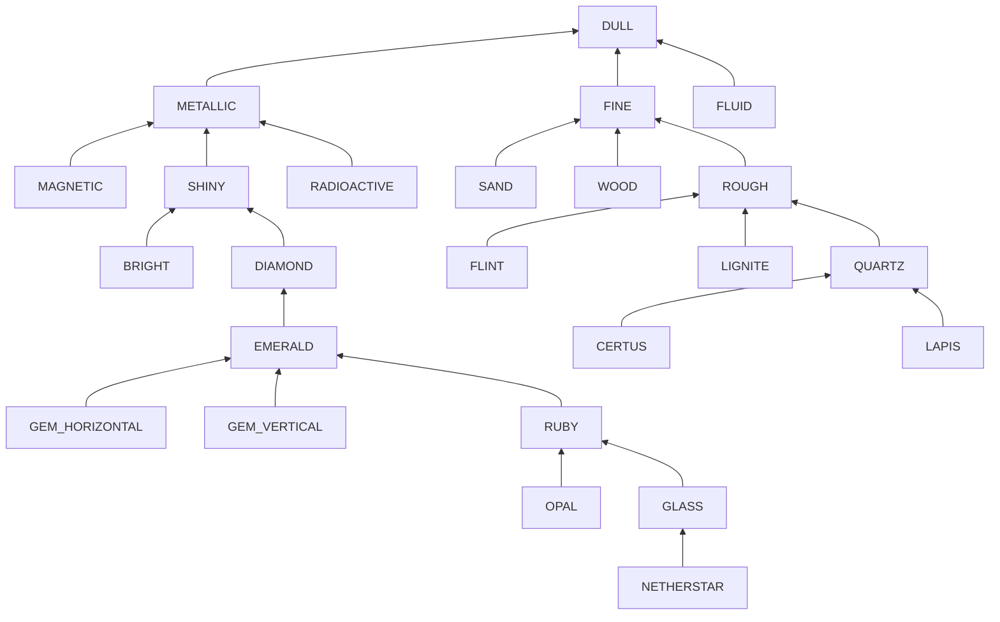

# Icon Sets

The material system uses icon sets to determine the textures of generated blocks and items.


## Available Icon Sets

The following icon sets are available by default:

- `GTMaterialIconSet.BRIGHT`
- `GTMaterialIconSet.CERTUS`
- `GTMaterialIconSet.DIAMOND`
- `GTMaterialIconSet.DULL`
- `GTMaterialIconSet.EMERALD`
- `GTMaterialIconSet.FINE`
- `GTMaterialIconSet.FLINT`
- `GTMaterialIconSet.FLUID`
- `GTMaterialIconSet.GAS`
- `GTMaterialIconSet.GEM_HORIZONTAL`
- `GTMaterialIconSet.GEM_VERTICAL`
- `GTMaterialIconSet.GLASS`
- `GTMaterialIconSet.LAPIS`
- `GTMaterialIconSet.LIGNITE`
- `GTMaterialIconSet.MAGNETIC`
- `GTMaterialIconSet.METALLIC`
- `GTMaterialIconSet.NETHERSTAR`
- `GTMaterialIconSet.OPAL`
- `GTMaterialIconSet.QUARTZ`
- `GTMaterialIconSet.ROUGH`
- `GTMaterialIconSet.RUBY`
- `GTMaterialIconSet.SAND`
- `GTMaterialIconSet.SHINY`
- `GTMaterialIconSet.WOOD`


## Custom Icon Sets

Custom iconsets can be specified as well, using the `gtceu:matieral_icon_set` event:

```js title="custom_iconsets.js"
GTCEuStartupEvents.registry('gtceu:material_icon_set', event => {
    event.create('starry')
        .parent('shiny')
})
```

## Available Icon Set Hierarchy

Icon sets may define only a specific subset of icons.
In case an icon set doesn't contain a specific icon for an item, the respective icon from its parent will be used.

The root icon set is `DULL`

